# Домашняя аптечка онлайн

Веб-приложение для учёта домашних лекарств: следит за сроками годности и помогает
вовремя передать ненужные нераспечатанные лекарства в приюты — пока они ещё годны,
а не после того, как их придётся выбросить.

Проект выполняется в рамках курса «Fullstack» (первый семестр).

## Стек

| Часть | Технологии |
|---|---|
| Frontend | React 19, TypeScript, Vite, React Router, MUI (Material UI), react-transition-group (анимации списков) |
| Backend | Python 3.12+, FastAPI, Pydantic, Uvicorn |
| Аутентификация | JWT (PyJWT, HS256) — access-токен; refresh-токен в httpOnly-cookie; пароли — Argon2id (argon2-cffi) |
| База данных | PostgreSQL 17 (в Docker), SQLAlchemy 2, миграции Alembic |
| Тесты backend | pytest |

## Назначение и пользователи

Пользователь — человек, который хранит дома лекарства и хочет:

- знать, что у него есть и где это лежит;
- не пропускать окончание срока годности;
- не выбрасывать лекарства, которые ему не нужны, а отдавать их тем, кому они пригодятся.

## Пользовательские сценарии

0. **Зарегистрироваться и войти.** Создать аккаунт по email и паролю или войти в существующий.
   Аптечка у каждого пользователя своя: чужие лекарства не видны и недоступны даже по прямой ссылке.
   Сессия переживает перезагрузку страницы; кнопка «Выйти» в меню пользователя завершает её.
1. **Посмотреть состояние аптечки.** Открыть главную страницу и сразу увидеть, сколько
   лекарств просрочено, сколько истекает в течение месяца и что лежит в списке на передачу.
2. **Найти лекарство.** В разделе «Моя аптечка» найти лекарство по названию, действующему
   веществу или месту хранения; отфильтровать по статусу срока годности.
3. **Добавить лекарство.** Заполнить форму с данными с упаковки (название, вещество,
   форма, количество, срок годности, место хранения, вскрыта ли упаковка).
4. **Посмотреть карточку лекарства.** Увидеть все данные, отметить упаковку вскрытой,
   удалить лекарство (с подтверждением) или добавить его в список «отдать до срока».
5. **Изменить лекарство.** Исправить данные в той же форме, что и при добавлении; при выходе
   с несохранёнными изменениями приложение спросит подтверждение.
6. **Отдать до срока.** Получить рекомендации — нераспечатанные лекарства, у которых
   осталось от 30 до 180 дней, — добавить их в список, выбрать приют и отметить передачу.
7. **Выбрать приют.** Посмотреть приюты (с фильтром «для людей / для животных»), что они
   принимают и с каким минимальным остатком срока годности.

## Экраны

| Экран | Маршрут | Назначение |
|---|---|---|
| Вход | `/login` | Email и пароль; после входа — возврат на страницу, которую открывали |
| Регистрация | `/register` | Имя, email, пароль с подтверждением; сразу выполняет вход |
| Главная | `/` | Сводка: счётчики, лекарства, требующие внимания, рекомендации |
| Моя аптечка | `/medicines` | Список с поиском, фильтром по статусу и сортировкой; всё хранится в адресе (`?status=ok\|soon\|expired&q=…&sort=name`) |
| Карточка лекарства | `/medicines/:id` | Подробности, отметка «вскрыто», добавление в список на передачу, удаление |
| Добавить лекарство | `/medicines/new` | Форма с клиентской валидацией |
| Изменить лекарство | `/medicines/:id/edit` | Та же форма, заполненная данными лекарства |
| Отдать до срока | `/donate` | Рекомендации, список на передачу, выбор приюта, история передач |
| Приюты | `/shelters` | Карточки приютов и их требования, фильтр по типу |
| 404 | `*` | Несуществующая страница |

Все экраны, кроме входа и регистрации, доступны только после входа: без него приложение
перенаправляет на `/login`, а вошедшего пользователя страницы входа и регистрации сразу отправляют дальше.

### Правила статусов

- **Просрочено** — срок годности уже прошёл (передавать нельзя, только утилизация).
- **Скоро истекает** — осталось 30 дней и меньше.
- **В порядке** — осталось больше 30 дней.
- Передать в приют можно только **невскрытое** лекарство с остатком срока **не меньше 30 дней**;
  у каждого приюта может быть своё, более строгое требование (например, от 3 месяцев).

## Скриншоты

Скриншоты всех экранов лежат в [`docs/screenshots`](docs/screenshots).

| Главная | Моя аптечка |
|---|---|
| 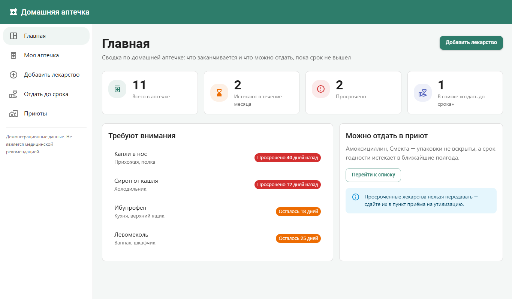 | 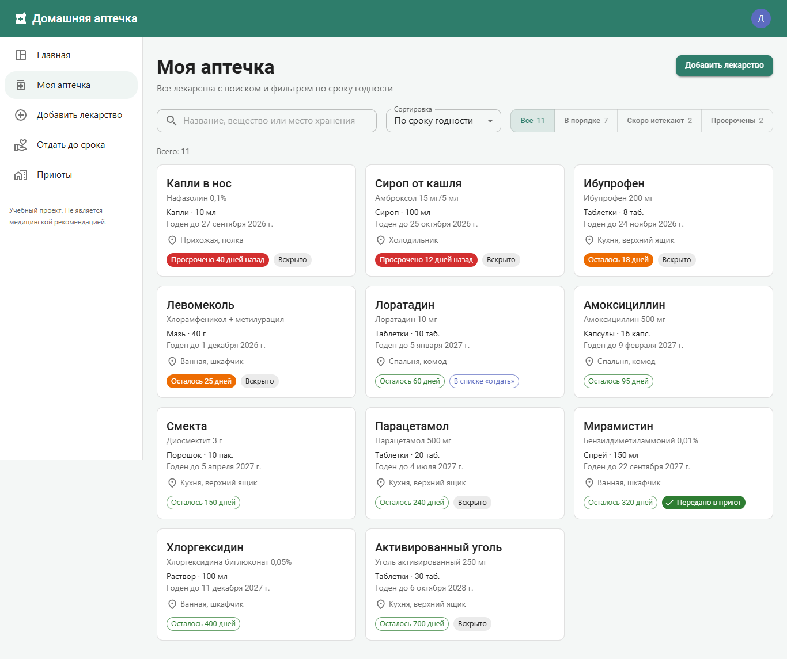 |
| **Карточка лекарства** | **Добавить лекарство** |
| 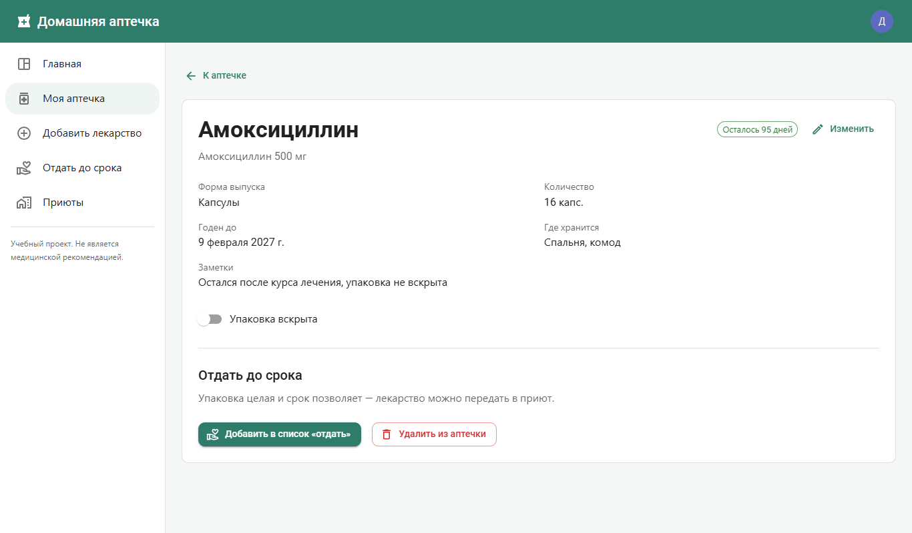 | 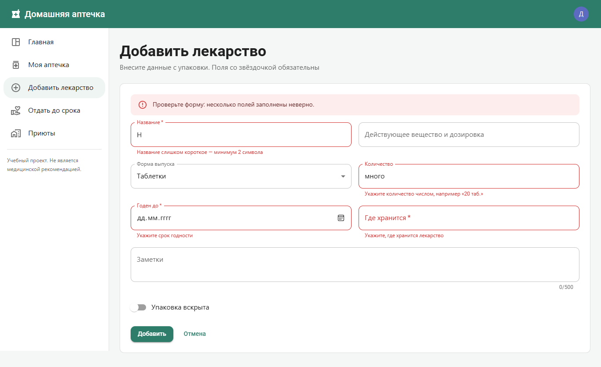 |
| **Отдать до срока** | **Приюты** |
| 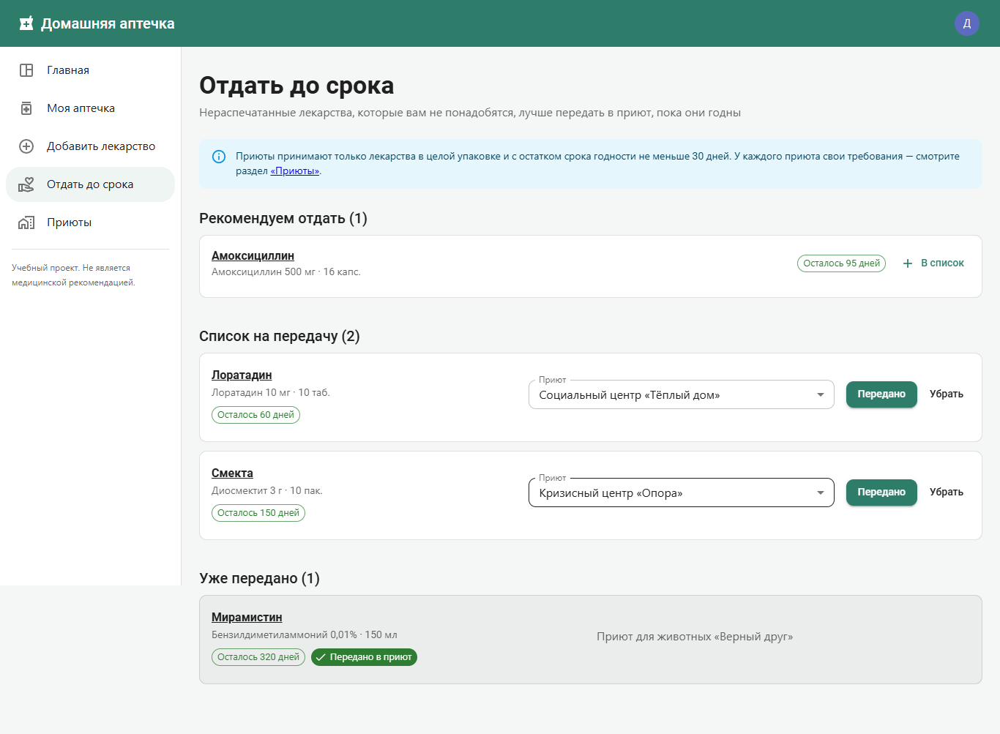 | 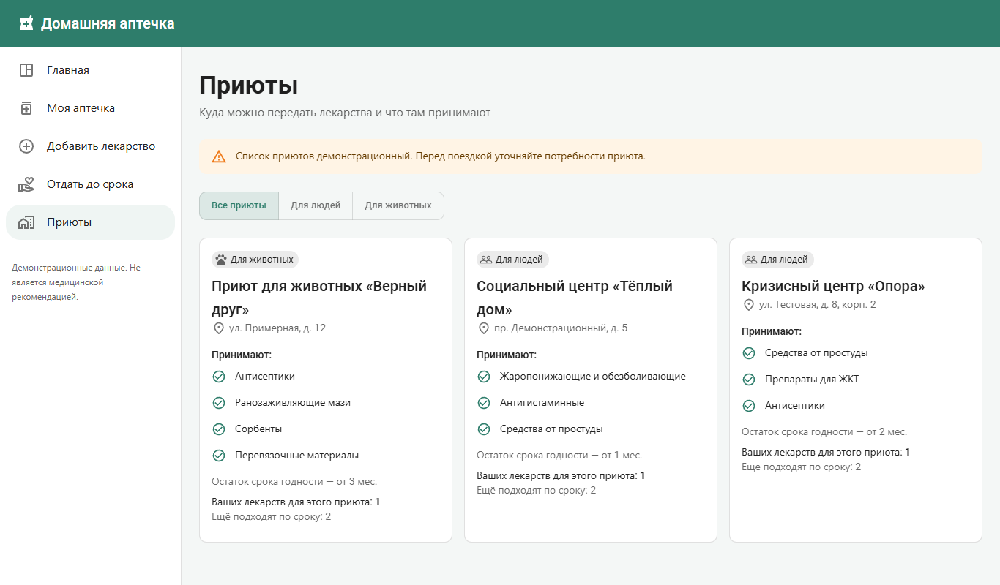 |
| **Мобильная версия: главная** | **Мобильная версия: фильтр «Скоро истекают»** |
| 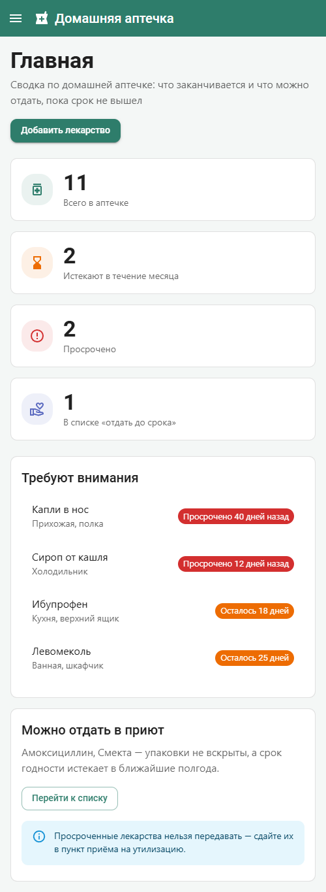 | 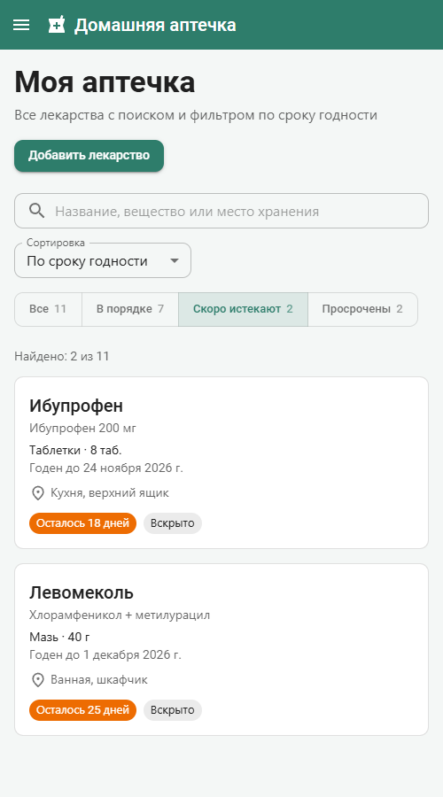 |
| **Изменить лекарство** | **Загрузка данных** |
| 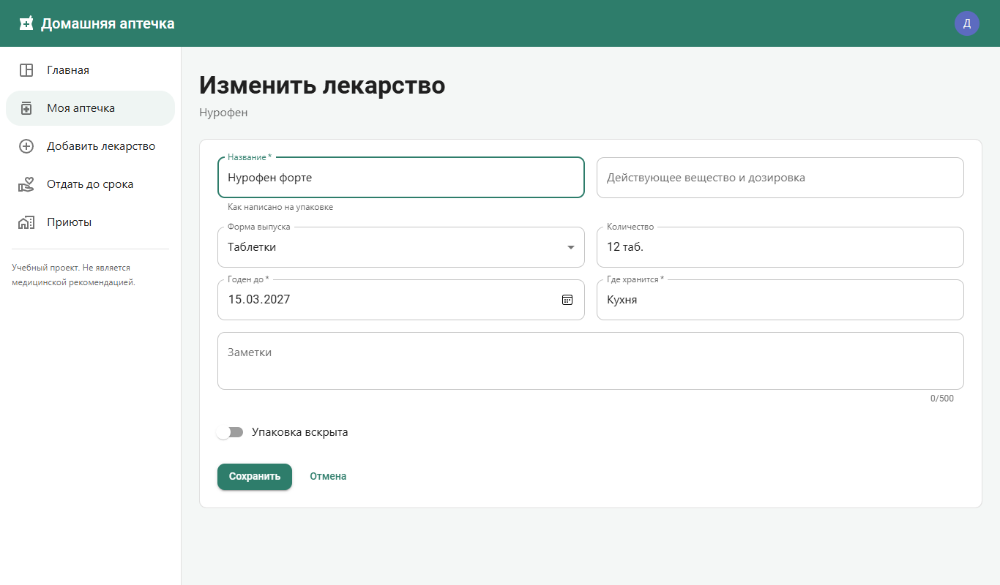 | 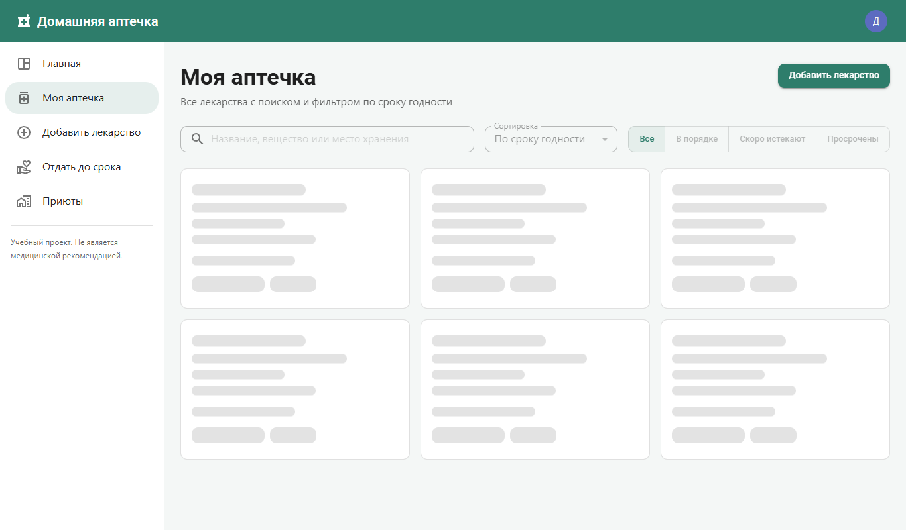 |
| **Ошибка сервера** | **Новый пользователь: пустая аптечка** |
| 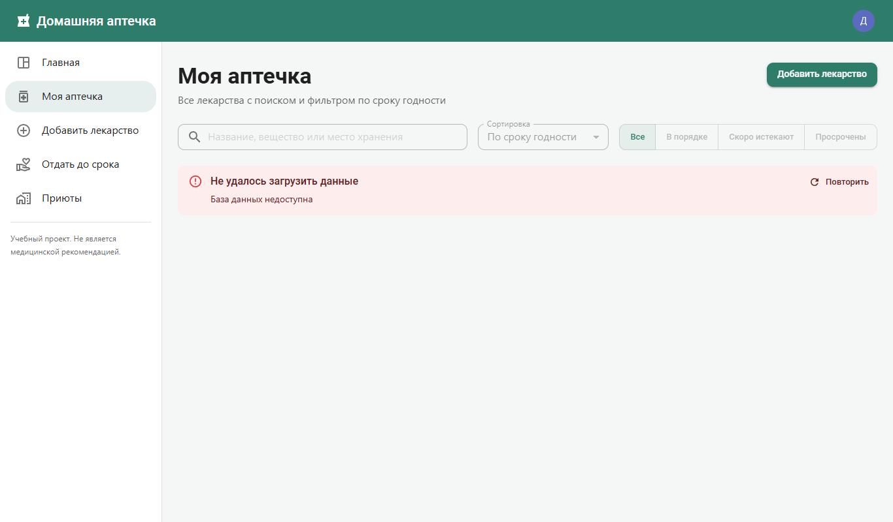 | 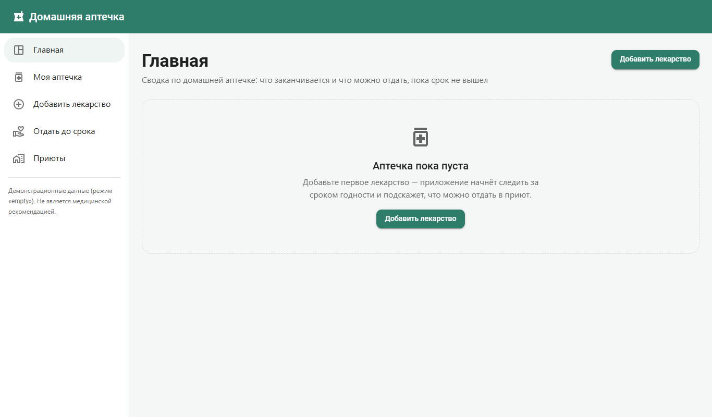 |
| **Вход** | **Регистрация: ошибки ввода** |
| 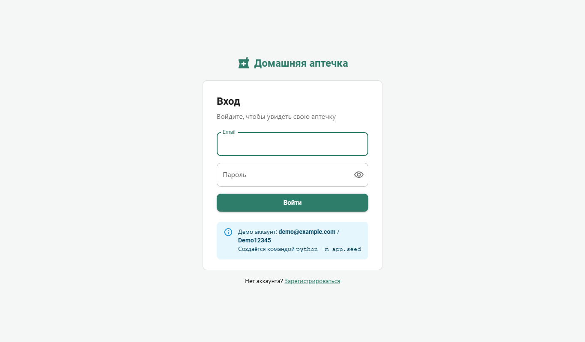 | 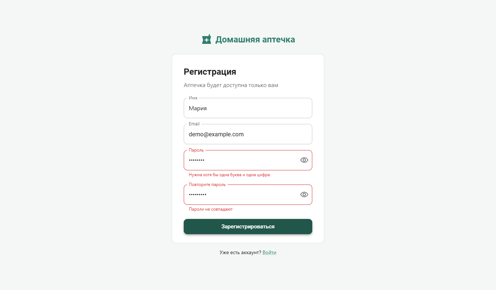 |
| **Меню пользователя и выход** | |
| 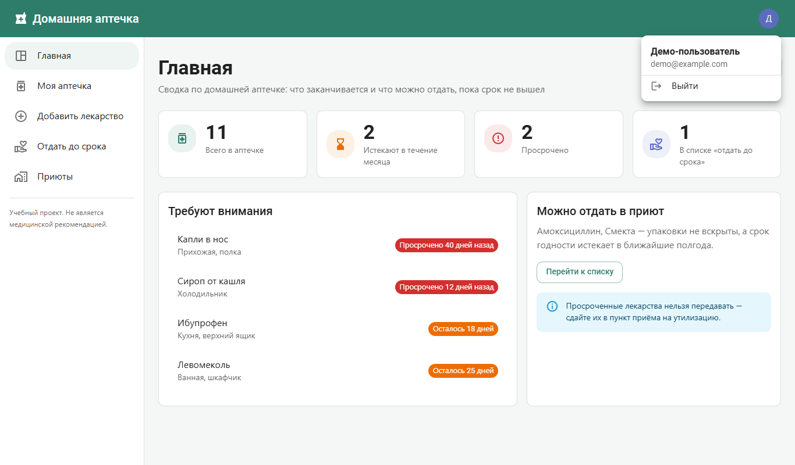 | |

## Запуск frontend

Требуется [Node.js](https://nodejs.org/) 20 или новее (проверено на Node.js 24 LTS).

```bash
cd frontend
npm install
npm run dev
```

Приложение откроется на <http://localhost:5173>. Для работы нужен запущенный backend (см. ниже):
dev-сервер Vite проксирует запросы `/api/*` на <http://localhost:8000>, поэтому для браузера
frontend и API находятся на одном адресе и cookie с refresh-токеном работает без настройки CORS.

Другие команды:

```bash
npm run build    # проверка типов и production-сборка в frontend/dist
npm run preview  # просмотр production-сборки
npm run lint     # ESLint
```

## Структура frontend

Код разделён по упрощённой методологии [Feature-Sliced Design](https://feature-sliced.design/):
слои расположены сверху вниз, и модуль может импортировать только из слоёв **ниже** себя.

```
app  →  pages  →  features  →  entities  →  shared
```

```
frontend/src/
├── main.tsx                    # Точка входа: монтирует <App />
├── app/                        # Настройка приложения
│   ├── App.tsx                 # Маршруты: публичные (вход, регистрация) и закрытые
│   ├── router/                 # RequireAuth / GuestOnly — защита маршрутов, возврат после входа
│   ├── providers/              # Тема MUI, роутер, уведомления, сессия пользователя
│   ├── layout/AppLayout.tsx    # Шапка с меню пользователя, боковое меню, переход между страницами
│   └── theme.ts                # Тема MUI
├── pages/                      # Страницы: компоновка фич и сущностей + состояния экрана
│   ├── dashboard/  medicines/  medicine-details/  add-medicine/  edit-medicine/
│   └── donate/  shelters/  login/  register/  not-found/
├── features/                   # Пользовательские действия
│   ├── auth/                   # Формы входа и регистрации, меню пользователя с выходом
│   ├── medicine-form/          # Добавление и редактирование: одна форма, правила валидации
│   ├── medicine-filters/       # Поиск, фильтр по статусу, сортировка (состояние в адресе)
│   ├── toggle-opened/          # Отметка «упаковка вскрыта»
│   ├── delete-medicine/        # Удаление с подтверждением
│   ├── manage-donation/        # В список «отдать», выбор приюта, отметка передачи
│   └── shelter-filter/         # Фильтр приютов по типу
├── entities/                   # Сущности предметной области
│   ├── session/                # Текущий пользователь: вход, регистрация, восстановление, выход
│   ├── medicine/
│   │   ├── model/              # Типы, правила сроков и передачи, хранилище (Context)
│   │   ├── api/                # Запросы к API и перевод ответов в модель frontend
│   │   └── ui/                 # Карточка лекарства, чипы статуса, скелетон
│   └── shelter/                # То же для приютов
└── shared/                     # Общее, не знает о предметной области
    ├── ui/                     # PageHeader, StatCard, EmptyState, ErrorState, ConfirmDialog, AuthCard,
    │                           # PasswordField, Appear (анимация появления), уведомления (Snackbar)
    ├── lib/                    # Даты, useAsyncList (загрузка списка), useAction (действие + уведомление)
    ├── api/                    # HTTP-клиент: access-токен, автообновление по refresh-токену, ApiError
    └── config/routes.ts        # Адреса страниц
```

Соглашения:

- У каждого слайса есть `index.ts` — публичный API. Снаружи импортируется только он, а не внутренние файлы.
- Бизнес-правила (статус срока, можно ли передать лекарство, примет ли его приют) описаны один раз
  в `entities/medicine/model` и совпадают с правилами backend: недоступные действия видны заранее,
  а сервер всё равно проверяет их сам.
- Страница отвечает за состояния экрана (загрузка, ошибка, нет данных), фича — за одно действие
  пользователя: вызов API, блокировку кнопки на время запроса и уведомление о результате.
- Упрощения относительно FSD: нет слоя `widgets`, а правило «приют принимает лекарство» лежит
  в сущности `medicine` и импортирует тип `Shelter` из сущности `shelter`.

### Интерактивность и состояния экранов

- **Формы.** Ошибка поля появляется после ухода с поля или попытки сохранить и исчезает сразу после
  исправления; при сохранении с ошибками фокус переходит на первое неверное поле. Проверяются
  обязательность, длина, формат количества, корректность и правдоподобность даты; для истёкшего
  срока показывается предупреждение, которое не мешает сохранению. Нельзя отметить вскрытым лекарство
  из списка на передачу (то же правило, что на backend).
- **Реакция на действия.** Кнопки блокируются и показывают индикатор на время запроса, результат
  сообщается всплывающим уведомлением; ошибки сервера показываются понятным текстом, а данные
  на экране остаются прежними.
- **Загрузка, ошибка, нет данных.** Пока данные загружаются — скелетоны; при ошибке — сообщение
  и кнопка «Повторить»; пустые списки и пустые результаты поиска — отдельные заглушки с подсказкой.
- **Анимации.** Плавный переход между страницами; карточки появляются и исчезают при смене фильтра;
  в разделе «Отдать до срока» лекарство сворачивается в рекомендациях и раскрывается в списке
  на передачу; смена подсказки в карточке лекарства; открытие диалогов и уведомлений.
  При системной настройке «уменьшить движение» анимации появления отключаются.

### Аутентификация во frontend

- **Access-токен** хранится только в памяти вкладки (`shared/api/http.ts`) — не в `localStorage`,
  откуда его мог бы прочитать внедрённый скрипт. Он добавляется в заголовок `Authorization: Bearer …`.
- **Refresh-токен** приходит в httpOnly-cookie: JavaScript его не видит, браузер сам отправляет
  cookie на `/api/auth/refresh`.
- **Автообновление.** Если запрос получил `401`, клиент один раз обновляет access-токен и повторяет запрос
  незаметно для пользователя. Одновременные запросы ждут одно общее обновление. Если обновить
  не удалось (сессия истекла или отозвана) — уведомление «Сессия истекла» и переход на страницу входа.
- **Перезагрузка страницы.** При запуске приложение пытается обновить токен по cookie; пока идёт
  проверка, показывается индикатор, а не страница входа.
- **Выход** вызывает `POST /api/auth/logout` (сервер отзывает refresh-токены сессии и удаляет cookie),
  забывает access-токен и размонтирует хранилища данных — на клиенте не остаётся данных пользователя.
  Другие открытые вкладки узнают о выходе через `BroadcastChannel` и тоже переходят на страницу входа.

## Backend

### Модель данных

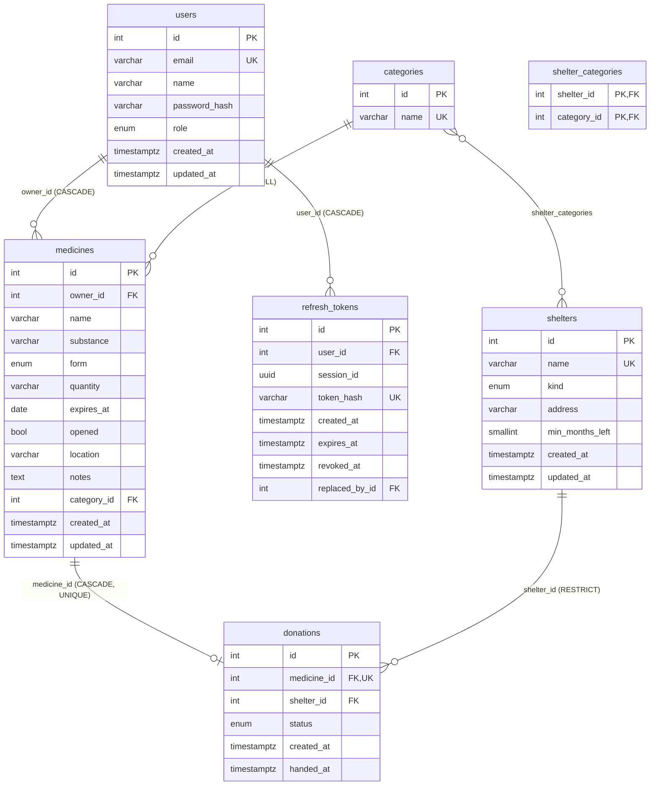
```mermaid
erDiagram
    users ||--o{ medicines : "owner_id (CASCADE)"
    users ||--o{ refresh_tokens : "user_id (CASCADE)"
    categories ||--o{ medicines : "category_id (SET NULL)"
    categories }o--o{ shelters : "shelter_categories"
    medicines ||--o| donations : "medicine_id (CASCADE, UNIQUE)"
    shelters ||--o{ donations : "shelter_id (RESTRICT)"

    users {
        int id PK
        varchar email UK
        varchar name
        varchar password_hash
        enum role
        timestamptz created_at
        timestamptz updated_at
    }
    refresh_tokens {
        int id PK
        int user_id FK
        uuid session_id
        varchar token_hash UK
        timestamptz created_at
        timestamptz expires_at
        timestamptz revoked_at
        int replaced_by_id FK
    }
    categories {
        int id PK
        varchar name UK
    }
    medicines {
        int id PK
        int owner_id FK
        varchar name
        varchar substance
        enum form
        varchar quantity
        date expires_at
        bool opened
        varchar location
        text notes
        int category_id FK
        timestamptz created_at
        timestamptz updated_at
    }
    shelters {
        int id PK
        varchar name UK
        enum kind
        varchar address
        smallint min_months_left
        timestamptz created_at
        timestamptz updated_at
    }
    shelter_categories {
        int shelter_id PK,FK
        int category_id PK,FK
    }
    donations {
        int id PK
        int medicine_id FK,UK
        int shelter_id FK
        enum status
        timestamptz created_at
        timestamptz handed_at
    }
```

| Таблица | Назначение |
|---|---|
| `users` | Пользователи: email (уникальный, в нижнем регистре), имя, хеш пароля Argon2id, роль `user` / `admin` |
| `refresh_tokens` | Выданные refresh-токены: SHA-256 от токена, сессия, срок действия, отзыв и токен-замена |
| `medicines` | Лекарства в аптечке; `owner_id` — владелец. Статус срока (`expired` / `soon` / `ok`) и `days_left` не хранятся, а вычисляются при ответе |
| `categories` | Группы лекарств: «Антисептики», «Антигистаминные» и т. п. |
| `shelters` | Приюты: тип (`animals` / `people`), адрес, минимальный остаток срока в месяцах |
| `shelter_categories` | Связь «многие ко многим»: какие категории принимает приют. Пустой список — принимает любые |
| `donations` | Список «Отдать до срока»: лекарство (одно лекарство — одна запись), выбранный приют, статус `planned` / `handed` |

Связи и поведение при удалении:

- **пользователь → лекарства** и **пользователь → refresh-токены** (один ко многим): при удалении пользователя удаляются его данные;
- **лекарство → категория** (многие к одному): при удалении категории у лекарств `category_id` становится `NULL`;
- **приют ↔ категория** (многие ко многим): при удалении приюта или категории удаляются строки связи;
- **лекарство → запись о передаче** (один к одному): при удалении лекарства удаляется и его запись;
- **приют → записи о передаче** (один ко многим): приют с передачами удалить нельзя (`RESTRICT`, ответ 409).

Ограничения в БД: уникальные названия категорий и приютов, `min_months_left >= 0`,
у переданного лекарства обязательно указаны приют и дата передачи (`CHECK`).

### Бизнес-правила

- В список на передачу можно добавить только **невскрытое** лекарство с остатком срока **не меньше 30 дней**.
- Приют принимает лекарство, если остаток срока не меньше его `min_months_left` × 30 дней
  и категория лекарства входит в принимаемые приютом (если список категорий задан).
- Отметить передачу (`status: handed`) можно только после выбора приюта. Переданную запись нельзя изменить или удалить.
- Нельзя изменить лекарство из списка на передачу так, чтобы его стало нельзя передать (например, отметить вскрытым).
- Рекомендации «отдать» — невскрытые лекарства не из списка с остатком срока от 30 до 180 дней.

### Аутентификация и авторизация

**Пароли** хранятся только в виде хеша **Argon2id** — алгоритма, созданного для хранения паролей
(медленный и требовательный к памяти, перебор по утёкшей базе дорог). При входе для несуществующего
email тоже выполняется проверка хеша, а ответ один — «Неверный email или пароль», поэтому по ответу
и времени нельзя узнать, зарегистрирован ли адрес. Требования к паролю: 8–128 символов, буква и цифра.

**Два токена:**

| | Access-токен | Refresh-токен |
|---|---|---|
| Формат | JWT, подпись HS256 секретом `JWT_SECRET`; в токене `sub` (id пользователя), `sid` (сессия), `type`, `iat`, `exp` | Случайная строка 256 бит (не JWT) |
| Срок | `ACCESS_TOKEN_TTL_MINUTES`, по умолчанию 15 минут | `REFRESH_TOKEN_TTL_DAYS`, по умолчанию 30 дней |
| Где у клиента | В теле ответа; frontend держит его в памяти | В cookie `refresh_token`: `HttpOnly`, `SameSite=Lax`, `Path=/api/auth`, `Secure` в production |
| Где на сервере | Не хранится, проверяется подпись и срок | В таблице `refresh_tokens` — только SHA-256 от токена |
| Зачем | Доступ к защищённому API: `Authorization: Bearer <token>` | Получение нового access-токена |

**Обновление** (`POST /api/auth/refresh`) работает с **ротацией**: refresh-токен меняется на новый,
старый отзывается. Отказ `401` — если токена нет, он неверный, истёк или отозван выходом.
Если уже обменянный токен предъявлен повторно (его мог украсть кто-то ещё), сервер завершает
всю сессию. Исключение — повтор в течение 10 секунд: так бывает, когда две вкладки обновляют токен
одновременно; тогда клиент получает код `refresh_token_rotated` и повторяет запрос с новой cookie.

**Выход** (`POST /api/auth/logout`) отзывает все refresh-токены текущей сессии и удаляет cookie:
обновить access-токен больше нельзя. Access-токены вышедшей сессии тоже перестают приниматься —
при каждом запросе проверяется, что сессия активна. Другие устройства пользователя остаются в системе.

**Права доступа:**

| Ресурс | Без входа | Пользователь | Администратор |
|---|---|---|---|
| `GET /api/health`, `GET` приютов и категорий | ✅ | ✅ | ✅ |
| Лекарства, список «отдать до срока» | `401` | ✅ только свои; чужие — `404` | ✅ только свои |
| Создание, изменение, удаление приютов и категорий | `401` | `403` | ✅ |

Чужое лекарство и чужая запись о передаче отвечают `404`, как несуществующие, — по ответу нельзя
узнать, какие id заняты другими пользователями. Попытка поставить в свой список чужое лекарство — `422`.

### API

Документация Swagger доступна после запуска: <http://localhost:8000/docs>. Чтобы вызывать защищённые
маршруты из Swagger, выполните `POST /api/auth/login`, скопируйте `access_token` и нажмите **Authorize**.

| Метод и путь | Доступ | Действие |
|---|---|---|
| `POST /api/auth/register` | все | Регистрация; сразу выполняет вход (access-токен + refresh-cookie) |
| `POST /api/auth/login` | все | Вход по email и паролю |
| `POST /api/auth/refresh` | refresh-cookie | Новый access-токен, ротация refresh-токена |
| `POST /api/auth/logout` | refresh-cookie | Выход: отзыв refresh-токенов сессии |
| `GET /api/auth/me` | вход | Текущий пользователь |
| `GET /api/medicines?status=&search=&category_id=` | вход | Свои лекарства (фильтры по статусу срока, тексту, категории) |
| `POST /api/medicines` | вход | Добавить лекарство |
| `GET / PATCH / DELETE /api/medicines/{id}` | вход, владелец | Получить, изменить, удалить лекарство |
| `GET /api/categories`, `GET /api/categories/{id}` | все | Категории |
| `POST /api/categories`, `PATCH / DELETE /api/categories/{id}` | админ | Изменение категорий |
| `GET /api/shelters`, `GET /api/shelters/{id}` | все | Приюты |
| `POST /api/shelters`, `PATCH / DELETE /api/shelters/{id}` | админ | Изменение приютов (`category_ids` — принимаемые категории) |
| `GET /api/donations?status=&shelter_id=` | вход | Свой список на передачу и история |
| `GET /api/donations/suggestions` | вход | Рекомендуем отдать |
| `POST /api/donations` | вход | Добавить своё лекарство в список |
| `GET / PATCH / DELETE /api/donations/{id}` | вход, владелец | Получить запись, выбрать приют или отметить передачу, убрать из списка |
| `GET /api/health` | все | Проверка работы API и подключения к БД |

Коды ответов и формат ошибок:

| Код | Когда | Тело ответа |
|---|---|---|
| `200` / `201` / `204` | Успешное чтение / создание / удаление | Данные или пусто |
| `401` | Нет access-токена, он неверный или истёк, сессия завершена; неверный пароль | `{"detail": "Срок действия токена истёк", "code": "token_expired"}` + заголовок `WWW-Authenticate: Bearer` |
| `403` | Недостаточно прав | `{"detail": "Недостаточно прав: операция доступна только администратору"}` |
| `404` | Нет записи с id из адреса | `{"detail": "Не найдено: лекарство с id=999"}` |
| `409` | Нарушено бизнес-правило или ограничение данных | `{"detail": "Передать можно только лекарство в невскрытой упаковке"}` |
| `422` | Некорректные данные или ссылка на несуществующую запись в теле | `{"detail": "Некорректные данные запроса", "errors": [{"field": "name", "message": "Обязательное поле"}]}` |
| `503` | База данных недоступна | `{"detail": "База данных недоступна"}` |

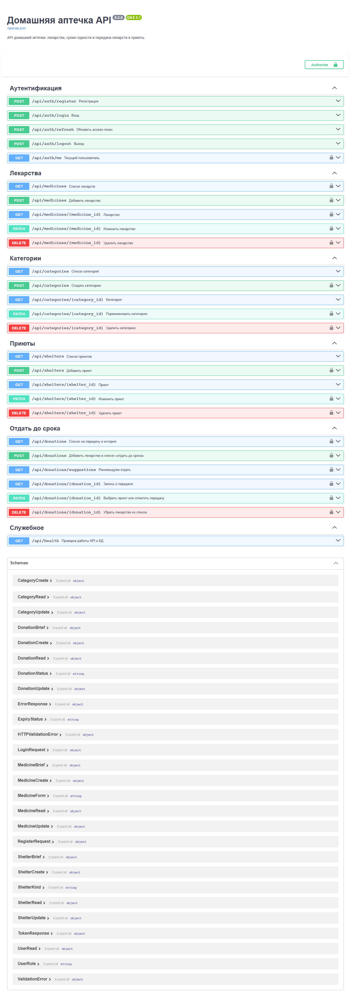

### Структура backend

```
backend/
├── app/
│   ├── main.py            # Создание приложения FastAPI, CORS, обработчики ошибок
│   ├── core/
│   │   ├── config.py      # Конфигурация из переменных окружения / backend/.env
│   │   ├── security.py    # Хеши паролей (Argon2id), access-токены (JWT), refresh-токены
│   │   └── errors.py      # Исключения бизнес-логики (Unauthorized, Forbidden, NotFound, Conflict…)
│   ├── db/
│   │   ├── base.py        # Базовый класс моделей, соглашение об именах ограничений
│   │   └── session.py     # Подключение к PostgreSQL, сессия на запрос (get_db)
│   ├── models/            # Модели SQLAlchemy (таблицы и связи)
│   ├── schemas/           # Схемы Pydantic: валидация запросов и формат ответов
│   ├── services/          # Операции с данными и бизнес-правила
│   ├── api/
│   │   ├── routes/        # Маршруты API по сущностям
│   │   ├── router.py      # Общий роутер /api и /api/health
│   │   ├── errors.py      # Перевод исключений в HTTP-ответы с сообщениями на русском
│   │   └── deps.py        # Зависимости: сессия БД, CurrentUser (проверка токена), AdminUser
│   └── seed.py            # Демонстрационные данные
├── alembic/               # Миграции БД
├── tests/                 # Тесты API на отдельной тестовой базе
├── .env.example           # Пример настроек без секретов
└── requirements.txt
```

Запрос проходит слои сверху вниз: `api/routes` (HTTP) → `schemas` (валидация) → `services`
(правила и запросы к БД) → `models` (таблицы). Сервисы не знают про HTTP: они выбрасывают
исключения из `core/errors.py`, а коды ответов выставляет `api/errors.py`.

## Запуск backend

Требуются Python 3.12+ и Docker (для PostgreSQL). Команды выполняются из корня репозитория.

1. **Настройки.** Скопируйте пример и задайте в `backend/.env` свой пароль БД и секрет для JWT:

   ```bash
   cp backend/.env.example backend/.env
   python -c "import secrets; print(secrets.token_urlsafe(48))"   # вставьте результат в JWT_SECRET
   ```

   Без `JWT_SECRET` (не короче 32 символов) приложение не запустится. Файл `.env` в репозиторий не попадает.

2. **База данных.** Запустите PostgreSQL в Docker — пользователь, пароль и имя базы берутся из `backend/.env`:

   ```bash
   docker compose up -d db
   ```

   Можно использовать и установленный локально PostgreSQL — тогда укажите его параметры в `backend/.env`.

3. **Зависимости.**

   ```bash
   cd backend
   python -m venv .venv
   .venv\Scripts\activate          # Windows
   # source .venv/bin/activate     # Linux / macOS
   pip install -r requirements.txt
   ```

4. **Создание таблиц** (миграции Alembic):

   ```bash
   alembic upgrade head
   ```

5. **Демонстрационные данные** (необязательно):

   ```bash
   python -m app.seed            # заполнить пустую базу
   python -m app.seed --reset    # очистить и заполнить заново
   ```

   Создаются пользователи (пароли только для демонстрации):

   | Email | Пароль | Роль |
   |---|---|---|
   | `demo@example.com` | `Demo12345` | пользователь, владелец демонстрационных лекарств |
   | `admin@example.com` | `Admin12345` | администратор: может изменять приюты и категории |

   Если в базе уже были лекарства из ЛР 2–3, миграция передаёт их пользователю `demo@example.com`
   с паролем `Demo12345`.

6. **Запуск API:**

   ```bash
   uvicorn app.main:app --reload --port 8000
   ```

   API: <http://localhost:8000/api>, документация: <http://localhost:8000/docs>.

### Тесты

```bash
cd backend
pytest
```

Тесты создают отдельную базу `<POSTGRES_DB>_test` на том же сервере и не трогают основную.
Проверяются CRUD всех сущностей, сохранение в БД, связи (каскадное удаление, `SET NULL`,
запрет удаления приюта с передачами), бизнес-правила и сообщения об ошибках, а также
аутентификация (`tests/test_auth.py`): хеширование паролей, регистрация и вход, проверка access-токена
(подпись, срок, тип, `alg=none`), ротация refresh-токена, отказ при неверном, истёкшем, отозванном
и повторно использованном токене, выход только из текущей сессии; и права доступа
(`tests/test_access.py`): закрытые и публичные маршруты, чужие данные, роль администратора.

### Новая миграция после изменения моделей

```bash
alembic revision --autogenerate -m "описание изменения"
alembic upgrade head
```

## Текущее состояние

**ЛР 1.** Реализованы все основные экраны и навигация между ними (React Router), библиотека
компонентов MUI, адаптивная вёрстка. Frontend пока работает на демонстрационных данных
в памяти браузера.

**ЛР 2.** Реализован backend на FastAPI: модель данных из пяти связанных таблиц в PostgreSQL,
CRUD для лекарств, категорий, приютов и списка на передачу, бизнес-правила передачи,
валидация запросов, понятные сообщения об ошибках и HTTP-статусы, миграции Alembic,
демонстрационные данные и автотесты. Подключение frontend к API — в следующих работах.

**ЛР 3.** Frontend перестроен по упрощённой схеме Feature-Sliced Design (app / pages / features /
entities / shared) без дублирования кода: одна форма для добавления и редактирования, общие
компоненты состояний и единые бизнес-правила. Добавлены экран редактирования лекарства, клиентская
валидация с понятными сообщениями, состояния загрузки, ошибки и отсутствия данных, уведомления
о результате действий, сортировка и поиск с сохранением в адресе, фильтр приютов, анимации
переходов и списков. Данные пока демонстрационные, но работа с ними идёт через асинхронный слой API,
который в следующей работе будет заменён запросами к backend.

**ЛР 4.** Добавлены регистрация и вход: пароли хранятся в БД в виде хешей Argon2id, сервер выдаёт
access-токен (JWT, 15 минут) и refresh-токен (30 дней, httpOnly-cookie, в БД — только хеш).
Обновление access-токена с ротацией refresh-токена; отказ при неверном, истёкшем, отозванном
или повторно использованном токене. Маршруты разделены на публичные и закрытые, лекарства
и список передачи привязаны к владельцу (чужие данные недоступны), изменение справочников — только
для администратора. Выход отзывает refresh-токены текущей сессии и очищает состояние на клиенте.
Frontend подключён к настоящему API вместо демонстрационных данных: страницы входа и регистрации,
защищённые маршруты, автоматическое обновление токена, меню пользователя.
